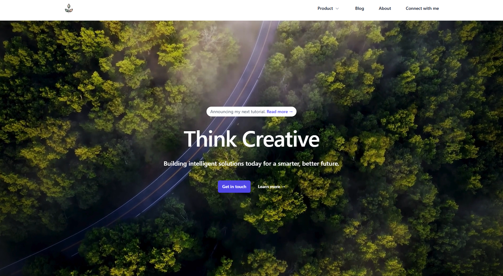

# La Voz - Next.js, Tailwind CSS & Framer Motion


La Voz is a stunning multi-page agency website template developed using Next.js, Tailwind CSS, and Framer Motion. Designed and built by the talented Tailwind CSS team, this template offers a sleek and minimalist appearance while boasting engaging interactive elements and captivating animations powered by Framer Motion.

## Features

- Beautifully designed agency website template.
- Built using Tailwind CSS and Next.js for a seamless development experience.
- Enhanced with delightful animations and transitions through Framer Motion.
- Easy-to-update case studies and blog posts with MDX.
- Production-ready and highly customizable for your agency's specific needs.
- A valuable resource for learning how to build websites with Tailwind CSS and React.

## Getting Started

To run the La Voz website locally, follow these steps:

1. **Clone the repository:**

   ```bash
   git clone https://github.com/your-username/abdullah-agency.git
   ```

# Portfolio Website

This repository contains the code for my personal portfolio website. The website showcases my projects, achievements, and contact information in a user-friendly layout.




## Table of Contents

- [Overview](#overview)
- [Features](#features)
- [Technologies Used](#technologies-used)
- [Installation](#installation)
- [File Structure](#file-structure)
- [Components](#components)
- [Contributing](#contributing)
- [License](#license)

## Overview

This portfolio website is designed to present my professional background, project experience, and skills in a visually appealing and organized format. The website is structured with multiple sections, each highlighting a different aspect of my work and achievements.

## Features

- **Hero Section**: A welcoming section introducing myself.
- **Portfolio Section**: Highlights a selection of my most significant projects.
- **Blog Section**: Displays insights and articles relevant to my field.
- **About Section**: Provides background information about my professional journey.
- **Recommendations Section**: Shows testimonials from people I have worked with.
- **Contact Form**: Allows visitors to reach out for inquiries or collaborations.
- **Footer**: Social media links and additional information about this site.

## Technologies Used

- **React**: JavaScript library for building user interfaces.
- **Tailwind CSS**: Utility-first CSS framework for styling.
- **JavaScript**: Core programming language for web development.
- **HTML** & **CSS**: Markup and styling for the website structure and layout.

## Installation

To set up this project locally, follow these steps:

1. **Clone the repository**:
   ```bash
   git clone https://github.com/yourusername/portfolio-website.git
   ```
   
2. **Navigate to the project folder**:
   ```bash
   cd portfolio-website
   ```

3. **Install dependencies**:
   ```bash
   npm install
   ```

4. **Run the development server**:
   ```bash
   npm start
   ```

   The site should now be running locally at `http://localhost:3000`.

## File Structure

The project is organized as follows:

```
portfolio-website/
├── public/                   # Public assets and favicon
├── src/
│   ├── assets/               # Images, logos, and other media
│   ├── components/           # React components for each section
│   │   ├── About.js          # About section
│   │   ├── Blog.js           # Blog section
│   │   ├── ContactUs.js      # Contact form section
│   │   ├── Footer.js         # Footer with social links
│   │   ├── Hero.js           # Hero section
│   │   ├── Portfolio.js      # Projects showcase
│   │   ├── RecQuo1.js        # Recommendation quote 1
│   │   └── RecQuo2.js        # Recommendation quote 2
│   ├── App.js                # Main App component
│   ├── index.js              # Entry point for React
│   └── App.css               # Global styles
└── README.md                 # Project documentation
```

## Components

Each section is built as a separate component to maintain modularity and reusability.

- **Hero**: The introductory section at the top of the website.
- **Portfolio**: Displays key projects, using components like `Card` and `ReverseCard` for layout.
- **Blog**: Lists recent blog posts or insights.
- **About**: Information about my professional journey and background.
- **Recommendations**: Displays quotes from colleagues or supervisors.
- **Contact Us**: A form where users can reach out.
- **Footer**: Links to social media and a note about the project.

## Contributing

If you'd like to contribute, feel free to fork the repository and submit a pull request.

## License

This project is licensed under the MIT License - see the [LICENSE](LICENSE) file for details.
# Getting Started with Create React App

This project was bootstrapped with [Create React App](https://github.com/facebook/create-react-app).

## Available Scripts

In the project directory, you can run:

### `npm start`

Runs the app in the development mode.\
Open [http://localhost:3000](http://localhost:3000) to view it in your browser.

The page will reload when you make changes.\
You may also see any lint errors in the console.

### `npm test`

Launches the test runner in the interactive watch mode.\
See the section about [running tests](https://facebook.github.io/create-react-app/docs/running-tests) for more information.

### `npm run build`

Builds the app for production to the `build` folder.\
It correctly bundles React in production mode and optimizes the build for the best performance.

The build is minified and the filenames include the hashes.\
Your app is ready to be deployed!

See the section about [deployment](https://facebook.github.io/create-react-app/docs/deployment) for more information.

### `npm run eject`

**Note: this is a one-way operation. Once you `eject`, you can't go back!**

If you aren't satisfied with the build tool and configuration choices, you can `eject` at any time. This command will remove the single build dependency from your project.

Instead, it will copy all the configuration files and the transitive dependencies (webpack, Babel, ESLint, etc) right into your project so you have full control over them. All of the commands except `eject` will still work, but they will point to the copied scripts so you can tweak them. At this point you're on your own.

You don't have to ever use `eject`. The curated feature set is suitable for small and middle deployments, and you shouldn't feel obligated to use this feature. However we understand that this tool wouldn't be useful if you couldn't customize it when you are ready for it.

## Learn More

You can learn more in the [Create React App documentation](https://facebook.github.io/create-react-app/docs/getting-started).

To learn React, check out the [React documentation](https://reactjs.org/).

### Code Splitting

This section has moved here: [https://facebook.github.io/create-react-app/docs/code-splitting](https://facebook.github.io/create-react-app/docs/code-splitting)

### Analyzing the Bundle Size

This section has moved here: [https://facebook.github.io/create-react-app/docs/analyzing-the-bundle-size](https://facebook.github.io/create-react-app/docs/analyzing-the-bundle-size)

### Making a Progressive Web App

This section has moved here: [https://facebook.github.io/create-react-app/docs/making-a-progressive-web-app](https://facebook.github.io/create-react-app/docs/making-a-progressive-web-app)

### Advanced Configuration

This section has moved here: [https://facebook.github.io/create-react-app/docs/advanced-configuration](https://facebook.github.io/create-react-app/docs/advanced-configuration)

### Deployment

This section has moved here: [https://facebook.github.io/create-react-app/docs/deployment](https://facebook.github.io/create-react-app/docs/deployment)

### `npm run build` fails to minify

This section has moved here: [https://facebook.github.io/create-react-app/docs/troubleshooting#npm-run-build-fails-to-minify](https://facebook.github.io/create-react-app/docs/troubleshooting#npm-run-build-fails-to-minify)
